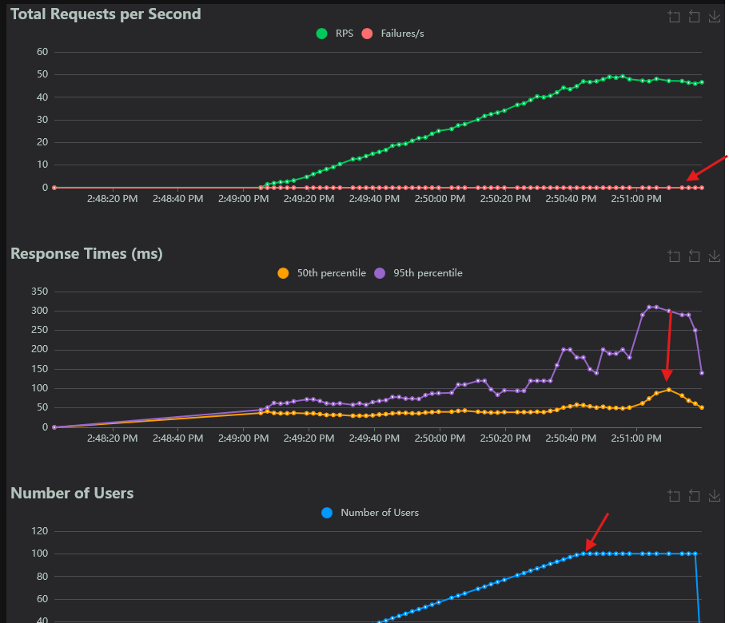
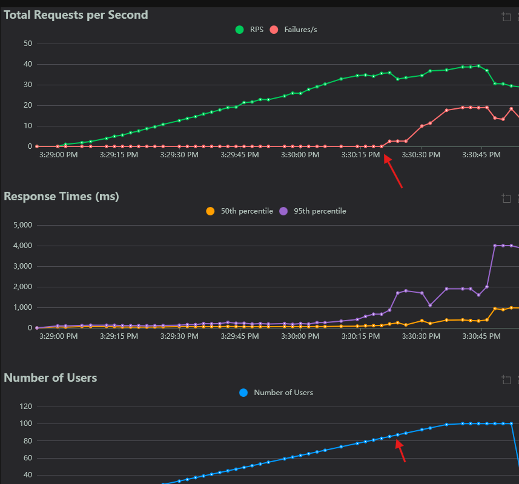
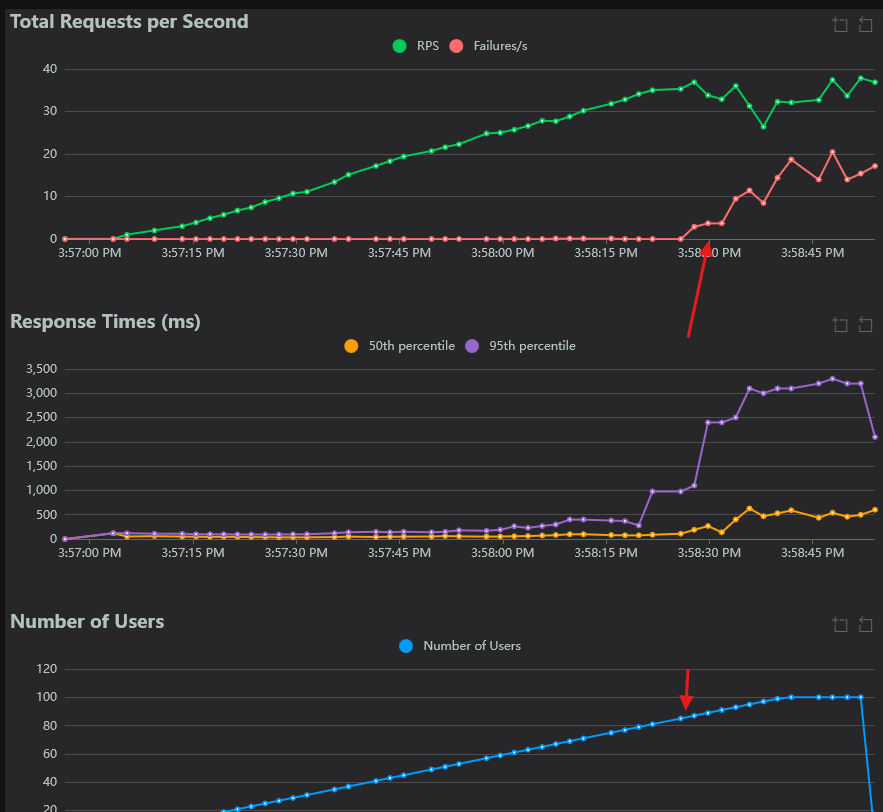
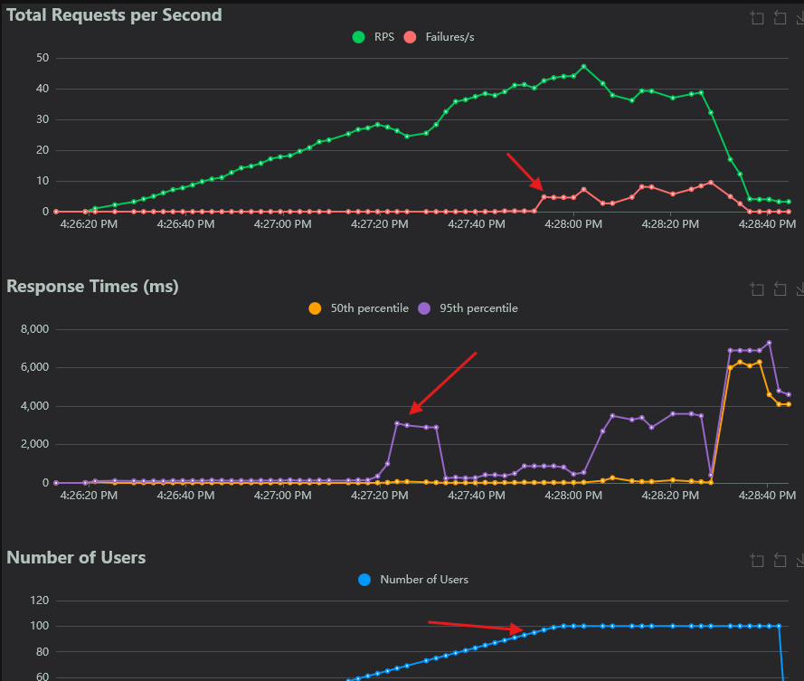
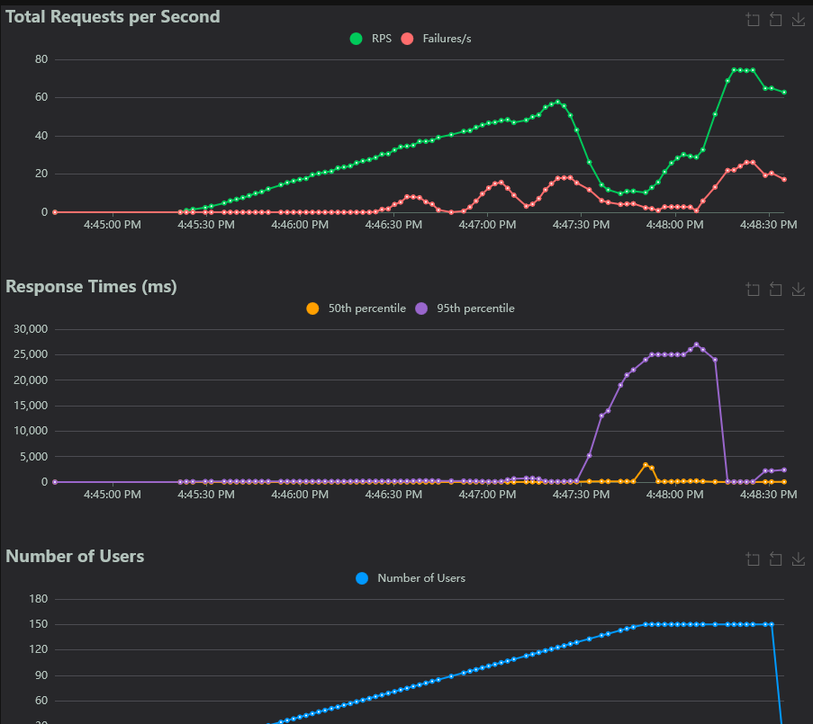

# Labo 04 — Rapport

 \
Jean-Christophe Benoit \
Rapport de laboratoire \
LOG430 — Architecture logicielle \
Montréal, 10 octobre 2025 \
École de technologie supérieure

> J'ai crée ce PDF en utilisant le gabarit markdown (.md).

## Questions

### Question 1

> Quelle est la latence moyenne (50ème percentile) et le taux d'erreur observés avec 100 utilisateurs ? Illustrez votre réponse à l'aide des graphiques Locust (onglet Charts).

On observe que la latence moyenne a atteint un maximum de 97 ms et qu'aucune erreur est observée avec 100 utilisateur simultanés :

### Question 2

> À partir de combien d'utilisateurs votre application cesse-t-elle de répondre correctement (avec MySQL) ? Illustrez votre réponse à l'aide des graphiques Locust.

À partir de 83 utilisateurs simultanés, l'application arrête de répondre correctement, car elle commence à retourner plusieurs erreurs 500 aux clients. les erreurs sont une des suivantes :

- 500 - (mysql.connector.errors.DatabaseError) 1040 (HY000): Too many connections
- 500 - (mysql.connector.errors.InternalError) 1213 (40001): Deadlock found when trying to get lock; try restarting transaction
- Des erreur 500 génériques
  

### Question 3

> À partir de combien d'utilisateurs votre application cesse-t-elle de répondre correctement (avec MySQL + optimisation) ? Illustrez votre réponse à l'aide des graphiques Locust.

Nous voyons une dégradation considérable du service à partir de 87 utilisateurs simultanés, car l'application commence à retourner les mêmes erreurs 500 qu'à l'étape d'avant.

On ne devrait pas s'attendre à voir une grande différence avec notre optimisation, car l'optimisation a réellement un effet drastique lorsque les commandes contiennent des milliers d'artivcles différents, tandis que dans notre cas, nous avons 4 articles différents maximum.

### Question 4

> À partir de combien d'utilisateurs votre application cesse-t-elle de répondre correctement (avec Redis + optimisation) ? Quelle est la latence et le taux d'erreur observés ? Illustrez votre réponse à l'aide des graphiques Locust.

L'application commence à retourner les mêmes erreurs 500 autour de 97 utilisateurs simultanés. C'est à ce moment que la qualité de service ne serait plus acceptable pour une application de production. On peut observer qu'après une minute, il y a une montée du temps de réponse, car les rapports doivent être recalculés :

Au lieu de faire la solution proposé dans l'énoncé, j'ai stocké les rapports en tant que string.

### Question 5

> À partir de combien d'utilisateurs votre application cesse-t-elle de répondre correctement (avec Redis + Optimisation + Nginx load balancing) ? Quelle est la latence moyenne (50ème percentile) et le taux d'erreur observés ? Illustrez votre réponse à l'aide des graphiques Locust.

De façon surprenante, à partir de 67 utilisateurs, les erreurs 500 ont commencé à être retournées. Toutes les erreurs étaient des erreurs _Too many connections_ de la base de données MySQL. La latence moyenne est restée autour de 20 ms jusqu'à ce qu'on atteigne 130 utilisateurs et le taux d'erreur a ondulé durant le test en atteignant un maximum de 18 erreur par seconde sur 55 requêtes totales.

### Question 6

> Avez-vous constaté une amélioration des performances à mesure que nous avons mis en œuvre différentes approches d'optimisation ? Quelle a été la meilleure approche ? Justifiez votre réponse en vous référant aux réponses précédentes.

Il semblerait que, dans notre cas d'étude contenant peut d'articles différents, la mise en cache des rapports est l'optimisations qui a beaucoup aidé à garder la latence et le nombre de requêtes en erreur stables. L'optimisation que nous avons fait des requêtes SQL n'est pas très utile dans notre contexte, comme expliqué dans la réponse à la question 3. Je m'attendais à ce que le load balancing amène une grande amélioration du côté du taux d'erreur, mais celui-ci semblait empirer le taux d'erreur de la base de données dû au nombre de connexion simultané. Cependant le load balancing a aidé pour garder une latence assez basse pour un grand nombre d'utilisateurs.

### Question 7

> Dans le fichier nginx.conf, il existe un attribut qui configure l'équilibrage de charge. Quelle politique d'équilibrage de charge utilisons-nous actuellement ? Consultez la documentation officielle Nginx si vous avez des questions.

La politique d'équilibrage de la charge _least_conn_ est utilisée. Cela veut dire que l'instance de store_manager avec le moins de connexions actives recevra la requête entrante.

## Observations additionnelles

### CI/CD

- Utilisation d'une VM Ubuntu 24.04 créée sur Microsoft Azure Portal for Students
- La VM héberge un self hosted runner pour exécuter le workflow de CI/CD et pour héberger les conteneurs déployés
- L'adresse IP public de la VM est 20.120.181.0 et les routes de l'API sont accessibles directement sur cette adresse sur le port 8080

### Problème(s) rencontré(s)

- Observations sur d’éventuels problèmes de setup ou de code rencontrés lors de l’exécution des activités (optionel).
- Problème avec le groupe de l'utilisateur sur la VM pour docker
- Installation de docker _from scratch_
- Compréhension de pourquoi le load balancing amène plus d'erreur 500 plus tôt
